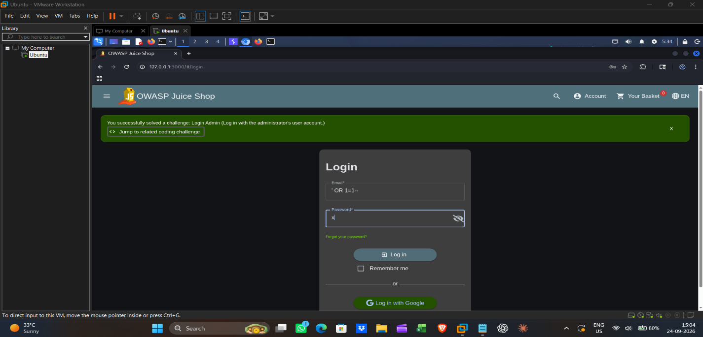
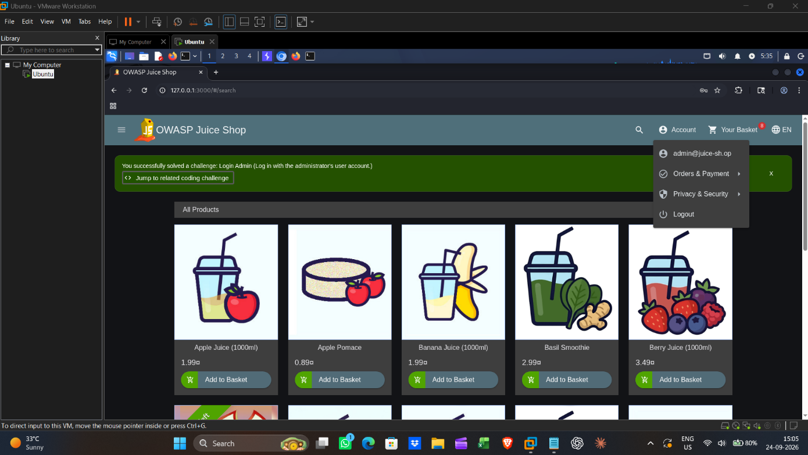
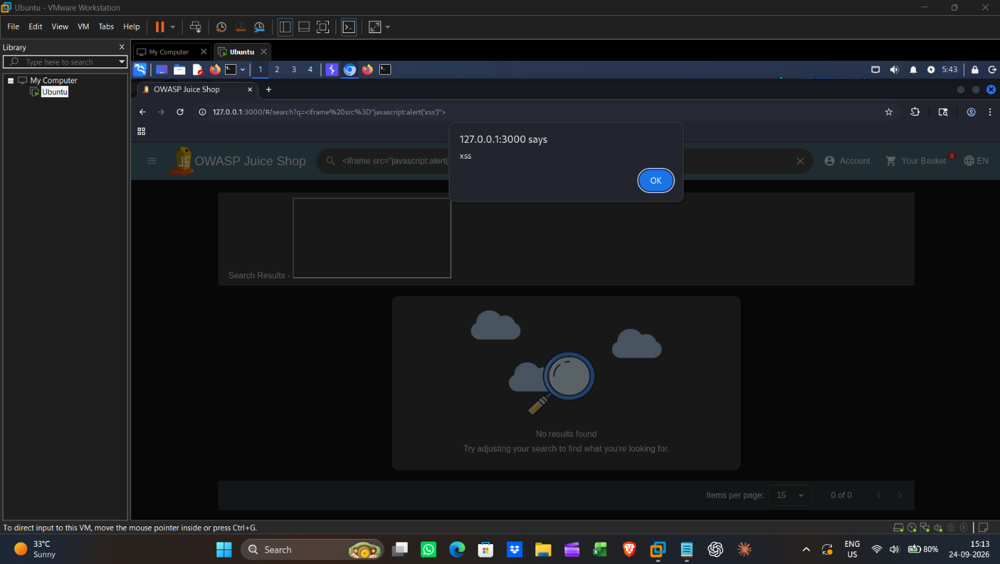
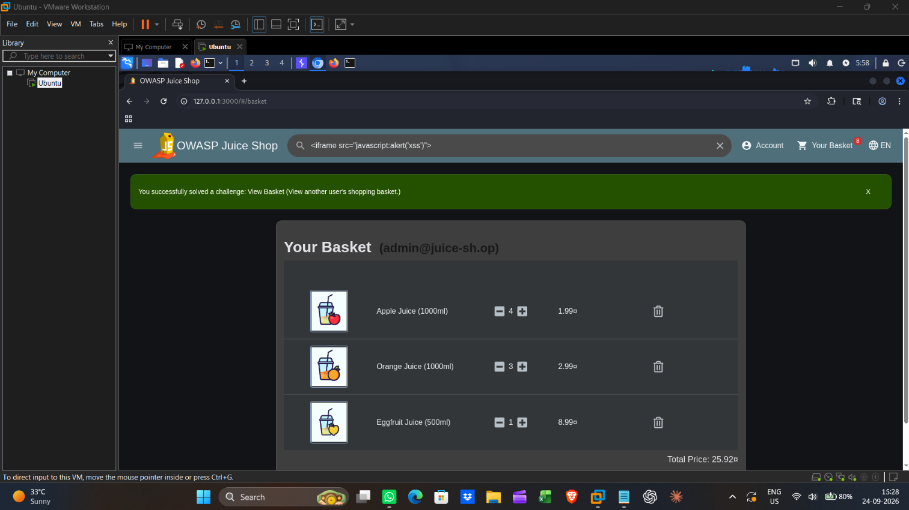
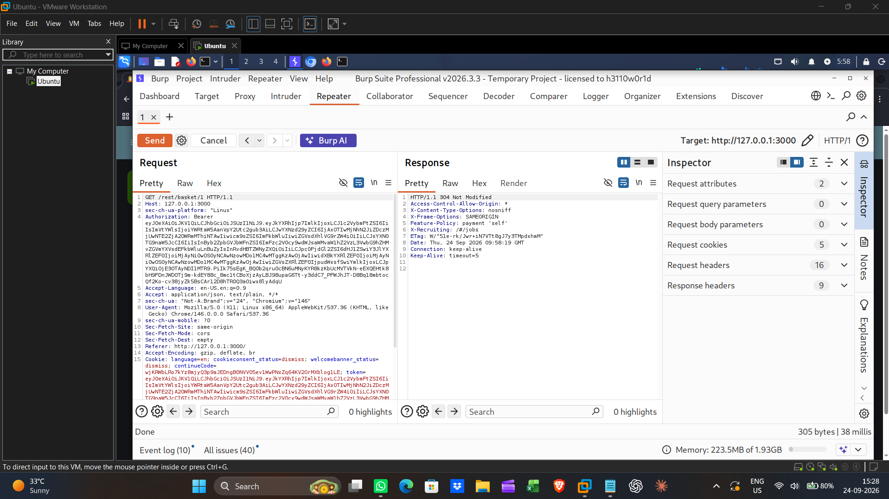
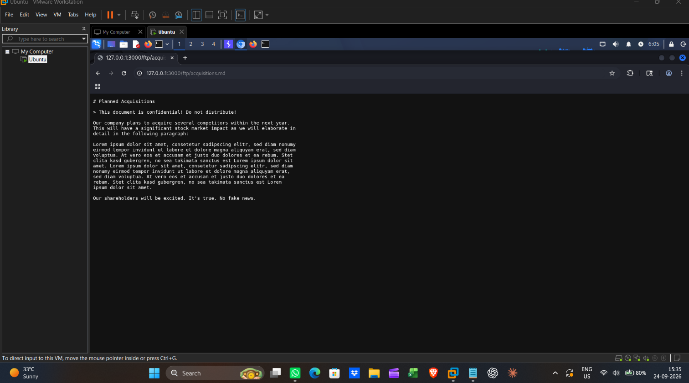
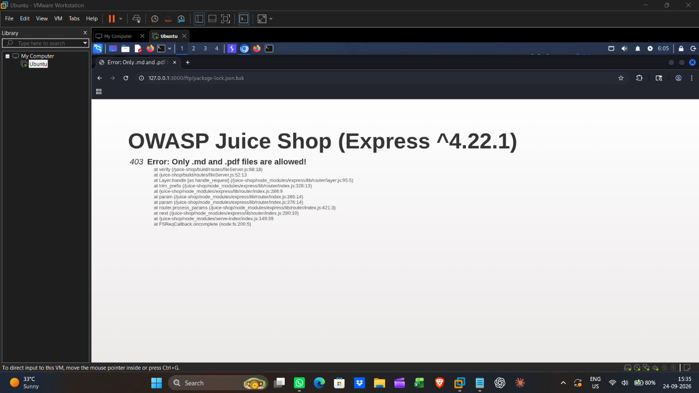
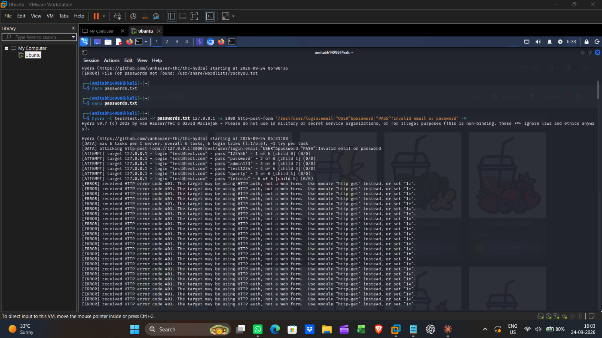
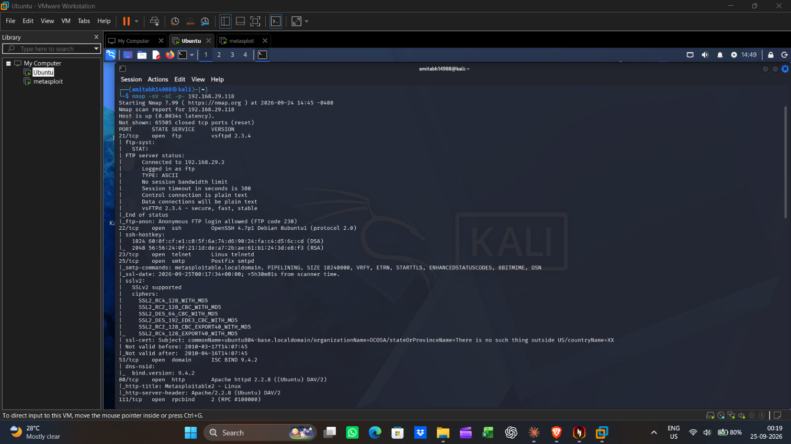

# Web Application VAPT Report — OWASP Juice Shop

**Target:** OWASP Juice Shop (local lab instance)
**Target URL:** http://127.0.0.1:3000
**Test Type:** Black-box Web Application Penetration Test
**Tester:** Amitabh Yadav
**Test Date:** 24/09/2026 – 25/09/2026
**Environment:** Kali Linux, Docker, isolated local lab (no external network exposure)
**Tools Used:** Nmap, Gobuster, Burp Suite, Hydra
**Standard Followed:** OWASP Top 10 (2021)

---

## Executive Summary

This report presents the findings of a black-box penetration test conducted against OWASP Juice Shop, a deliberately vulnerable web application, in an isolated local lab environment. The objective was to identify security vulnerabilities using industry-standard tools and methodology aligned with the OWASP Top 10, and to demonstrate practical, hands-on penetration testing skills.

A total of 5 vulnerabilities were identified during this assessment, ranging from Critical to Medium severity. The most significant finding was a SQL Injection vulnerability in the login form, which allowed complete authentication bypass.

## Scope

The scope of this assessment was limited to the OWASP Juice Shop application running locally at `http://127.0.0.1:3000`, inside an isolated Docker container on Kali Linux. No external, production, or third-party systems were tested.

## Methodology

- **Reconnaissance** — service and port discovery using Nmap
- **Content Discovery** — directory/file enumeration using Gobuster
- **Vulnerability Identification** — manual testing and traffic analysis using Burp Suite
- **Exploitation** — proof-of-concept exploitation of identified vulnerabilities
- **Reporting** — documentation of findings, impact, and remediation

## Summary of Findings

| # | Finding | OWASP Category | Severity |
|---|---|---|---|
| 1 | SQL Injection in Login Form | A03:2021 – Injection | **Critical** |
| 2 | Reflected XSS in Search Field | A03:2021 – Injection | **High** |
| 3 | IDOR in Basket API | A01:2021 – Broken Access Control | **High** |
| 4 | Sensitive Data Exposure via `/ftp` | A05:2021 – Security Misconfiguration | **Medium** |
| 5 | Weak Password Policy / No Brute-Force Protection | A07:2021 – Auth Failures | **Medium** |

---

## Detailed Findings

### Finding 1: SQL Injection in Login Form
**Severity:** Critical | **OWASP Category:** A03:2021 – Injection

**Steps to Reproduce:** Navigated to the Juice Shop login page. Entered `' OR 1=1--` in the email field and an arbitrary value in the password field, then submitted the form.

**Result:** Authentication was bypassed and the application logged in as the admin account without valid credentials.

**Impact:** An attacker can bypass authentication entirely and gain unauthorized access to any account, including administrative accounts, compromising the confidentiality and integrity of the entire application.

**Remediation:** Use parameterized queries / prepared statements for all database interactions. Implement strict server-side input validation and never concatenate user input directly into SQL queries.

---

### Finding 2: Reflected XSS in Search Field
**Severity:** High | **OWASP Category:** A03:2021 – Injection

**Steps to Reproduce:** Entered the payload `` into the Juice Shop search box and submitted it.

**Result:** The injected JavaScript executed in the browser, triggering a popup alert, confirming that user input is reflected into the page without proper sanitization or encoding.

**Impact:** An attacker could use this to steal session cookies, redirect users to malicious sites, or perform actions on behalf of the victim (session hijacking, phishing).

**Remediation:** Apply context-appropriate output encoding on all user-supplied input before rendering it in HTML. Implement a strict Content-Security-Policy (CSP) header to restrict inline script execution.

---

### Finding 3: Insecure Direct Object Reference (IDOR) in Basket API
**Severity:** High | **OWASP Category:** A01:2021 – Broken Access Control

**Steps to Reproduce:** Logged in as a test user and added a product to the basket. Captured the basket request (`/rest/basket/<id>`) in Burp Suite, sent it to Repeater, and modified the basket ID to a different numeric value belonging to another user.

**Result:** The response returned another user's basket contents, even though the request was made from a different, unauthorized account.

**Impact:** An attacker can view or potentially modify other users' order/basket data simply by changing an ID value, leading to a privacy breach and unauthorized data access.

**Remediation:** Implement server-side authorization checks to verify that the requesting user owns the resource being accessed, rather than relying solely on the object ID supplied in the request.

---

### Finding 4: Sensitive Data Exposure via Exposed `/ftp` Directory
**Severity:** Medium | **OWASP Category:** A05:2021 – Security Misconfiguration

**Steps to Reproduce:** Browsed directly to the `/ftp` endpoint of the application without authentication.

**Result:** An unprotected directory listing was accessible, exposing internal/backup files that should not be publicly available.

**Impact:** Exposed files may reveal internal application details, backup data, or other information useful to an attacker for further exploitation.

**Remediation:** Remove unnecessary exposed directories from the production server, or place them behind proper authentication. Backup and internal files should never be publicly accessible.

---

### Finding 5: Weak Password Policy / No Brute-Force Protection
**Severity:** Medium | **OWASP Category:** A07:2021 – Identification and Authentication Failures

**Steps to Reproduce:** Using Hydra, performed a dictionary-based brute-force attack against a test account on the `/rest/user/login` endpoint with a small custom password list.

**Result:** The correct password was successfully identified within a small number of attempts, and the application did not implement any account lockout, rate-limiting, or CAPTCHA after multiple failed login attempts.

**Impact:** Accounts using weak or common passwords can be compromised through automated brute-force attacks, since there is no mechanism to detect or block repeated failed login attempts.

**Remediation:** Implement account lockout after a defined number of failed attempts, add rate-limiting on the login endpoint, and introduce CAPTCHA to prevent automated attacks.

---

## Conclusion

This assessment identified 5 vulnerabilities in OWASP Juice Shop, including one Critical and two High severity issues that could lead to full authentication bypass and unauthorized data access. Addressing the SQL Injection and Access Control issues should be prioritized, followed by the remaining Medium severity findings. This exercise demonstrates practical, hands-on penetration testing skills across injection, access control, information disclosure, and authentication vulnerability classes using industry-standard tools (Nmap, Gobuster, Burp Suite, Hydra).
